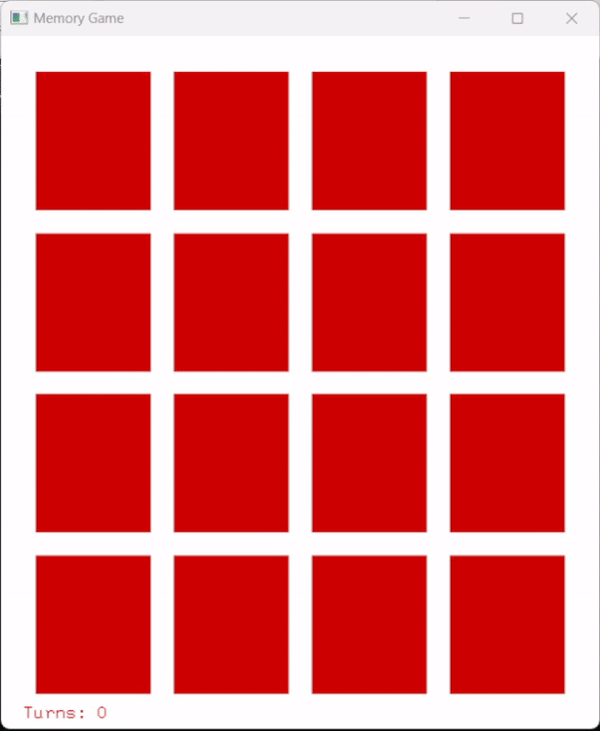

# Memory Game

OpenGL GUI implementation of the popular children's card flip memory game.



To play, a set of 16 cards containing pairs of matching objects are shuffled and placed in a 4 × 4 grid, face down.
In this solitaire version, a player can turn over any two cards and, if they match, can remove them from the board. Otherwise, they
are turned over, and the player gets to turn over two more cards. The objective is to remove all of
the cards in as least turns as possible. 

## Features
- Card flip animations
- Turn count tracker
- Randomly generated colors & card placements

## Installation
To run this application, I used FreeGlut with Code::Blocks. Below are the steps to my setup.
1. Clone the repository:
   ```
   git clone https://github.com/mctripp10/memory-game.git
   ```
   
2. Download [Code::Blocks](https://www.codeblocks.org/) 
3. Download [FreeGlut for MinGW](https://www.transmissionzero.co.uk/software/freeglut-devel/)
4. Follow the steps under "Installation" [here](https://wiki.codeblocks.org/index.php/Using_FreeGlut_with_Code::Blocks) to finish project setup and link everything properly
